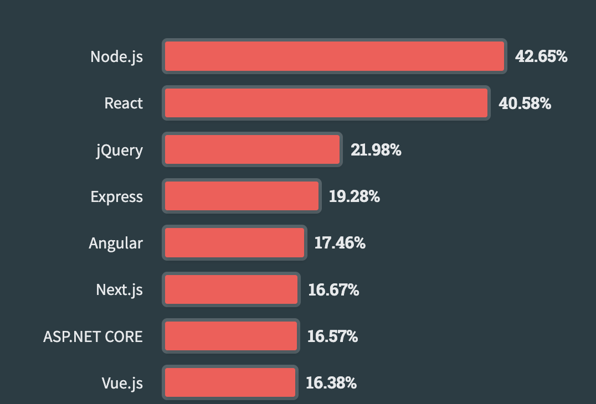

# 이원도 202230226
## 9월 4일

### 바벨과 웹팩 설정 커스터마이징
- 바벨이나 웹팩의 설정도 커스터마이징 할 수 있습니다.
- 바벨은 자바스크립트 트랜스컴파일러이며, 최신 자바스크립트 코드를 하위 호환성을 보장하는 스크립트 코드로 변환하는 일을 담당합니다.
- 하위 호환성이 보장되면 어떤 웹 브라우저에서든 자바스크립트 코드를 실행할 수 있습니다.
- 바벨을 사용하면 브라우저나 Node.js 등에서 지원하지 않는 새롭고 훌륭한 기능을 현재의 환경에서도 실행할 수 있습니다.
- 바벨 설정을 커스터마이징 하려면, 프로젝트 Root에 .babelrc라는 파일을 생성하면 됩니다.
- 이 설정 파일을 비워 두면 오류가 발생하기 때문에 최소한 다음 내용을 저장해야 합니다.

### 타입스크립트 지원
- Next.js는 타입스크립트로 작성되었기 때문에 고품질의 type definiton을 지원합니다.
- 기본 언어를 타입스크립트로 지정하려면 root에 tscoonfig.json이라는 설정파일 생성하면 됩니다.
- 그런 다음 `npm run dev` 명령을 실행하면 됩니다.

### 프로젝트의 기본 구조
- pages/ 디렉토리 안의 모든 js파일은 public 페이지가 됩니다.
- pages/ 의 Index.jsv 파일을 복사해서, about.js로 이름을 바꾸면, localhost:3000/about으로 접속할 수 있습니다.
- public/ 디렉토리에는 웹 사이트의 모든 퍼블릭 페이지와 정적 콘텐츠가 있습니다.
- styles/ 디렉토리에는 앱에서 사용하는 스타일시트 넣습니다.
- 용도가 정해져 있는 디렉토리는 pages/ 와 public 뿐입니다.
- 나머지 디렉토리는 필요에 따라서 다른 목적으로 사용하거나 삭제해도 됩니다.

### 프로젝트 생성 방법
- create-next-app을 이용하여 프로젝트를 생성해봅니다.
- `npx create-next-app<app-name>` -> `npx create-next-app@latest`
- Next 13.4 부터 라우터가 /src/pages에서 /src/app로 정식 변경
- 만일 pages를 사용하고 싶다면, App Router를 No라고 해주면 됩니다.
- 프로젝트가 생성되면 프로젝트 디렉토리로 이동하여 다음 명령을 실행합니다. npm run dev
- React처럼 바로 실행되지 않기 때문에 localhost:3000으로 접속하여 확인합니다. "Ctrl + 클릭"

### nvm의 주요 명령어
- 설치되어 있는 node 리스트 확인
- Node 설치 : install
    - nvm install 16.16.0  -> 16.16.0 버전 설치
    - nvm install latest  -> latest current version 설치
    - nvm install lts
- Node 삭제 : uninstall
- 사용할 Node 버전 선택 : use
- 사용중인 버전 확인 : current
- 설치 가능한 node version 목록 확인 : list available

## 8월 28일
### Page Router vs App Router
- React로 개발하다 처음 Next를 사용하면 제일 먼저 놀라는 기능이 Router 입니다.
- Next.js 13.4에서부터 App Router가 Stable하게 지원하기 시작했습니다.

#### [Page Router]
- pages 디렉토리가 root이고, index.js가 index page가 됩니다.
- about.js는 /about , team.js는 /team 경로로 라우팅 됩니다.
- 클라이언트 중심의 라우팅입니다.

#### [App Router]
- app 디렉토리가 root이고, page.js가 index page가 됩니다.
- /about/page.js는 /about, /login/page.js는 /page 경로로 라우팅 됩니다.
- 서버 중심의 라우팅입니다.
- 번들 사이즈가 작습니다.

### Next.js 13 vs 14
- Pages Router -> App Router
- Data Fetching : 13까지는 getServerSideProps, getStaticProps 메소드를 이용해서 구현 했으나, 14에서는 SSG(정적 사이트 생성), SSR(서버측 렌더링) 및 ISR(증분적 정적 재생성)에서 하나의 API만을 사용해서 구현할 수 있게 되었습니다.
- Tubopack : Rust 기반으로 개발된 새로운 번들러 사용으로 webpack보다 700배 빠르다고 발표했습니다.
- Tubopack은 3000개의 모듈이 있는 애플리케이션에서 1.8초 만에 부팅되고, Webpack은 16.5초, Vite는 11.4초가 걸립니다.

- 이미지 최적화 : 13까지는 도구를 사용하였으나, 14부터는 자체적으로 지원하기 시작했습니다.
- 보안 강화 : XSS 공격에 대한 보호 기능이 강화되고, 보안 관련 헤더 설정을 더욱 쉽게 만들었습니다.

### Next.js 알아보기
- Next.js는 리액트를 위해 만든 오픈소스 자바스크립트 웹 프레임워크 입니다.
- 리액트에는 없는 다양한 기능을 제공합니다.
    - 서버 사이드 렌더링(SSR: Server Side Rendering)
    - 정적 사이트 생성(SSG: Static Site Generation)
    - 증분 정적 재생성(ISR: Incremental Static Regenration)

 

`SSG(정적 페이지 생성)는 미리 만들어 놓은 페이지를 서비스 하기 때문에 속도는 빠르지만, 한번 생성하고 나면 수정이 불가능합니다. 이러한 단점을 보완하고자 나온 것이 ISR(증분 정적 재생성)입니다. 이미 생성된 페이지를 일정 시간이 지난 후에 다시 생성합니다. (최신 데이터로 업데이트)`

### [Chapter 1의 주요 내용]
- Next.js 소개 / 다른 프레임워크와의 비교 / 리액트와의 차이점
- 기본구조 타입스크립트를 사용하는 방법
- 바벨과 웹팩 설정 커스터 마이징 (Next.js 14는 Webpack에서 Tubopack으로 바뀜)

### 준비하기
- Node.js와 npm을 설치하거나 codesandbox.io 혹은 repl.it 등의 사이트를 이용합니다.
- 이 후 프로젝트별로 필요한 의존성 패키지를 npm으로 설치합니다.
- 잠시 확인을 위한 것이면 사이트를 이용해도 되지만, 그렇지 않은 경우라면 local에 환경을 설정하는 것이 좋습니다.

### Next.js란?
Angular, React, Vue 와 같은 프레임워크가 등장하면서 웹 개발 분야는 급속도로 변하기 시작
1. 리액트는 메타(페이스북)의 조던 발케가 만들어 2013년 오픈소를 발표합니다.
2. 리액트는 클라이언트 사이드(CSR)에서만 작동한다는 문제점이 있습니다.
3. 이 문제를 해결하기 위해 서버에서 미리 렌더링해 두는 방법을 연구하기 시작합니다.
4. 이러한 연구의 결과로 나온 것이 Next.js입니다.
5. 이 밖에 리액트가 제공하지 않는 여러가지 기능을 제공하게 됩니다.

#### [Next.js가 제공하는 새로운 기능들]
- 코드 분할 : 페이지를 로딩 할 때 번들을 여러 조각으로 나누어 필요한 부분만 전송
- 파일 기반 라우팅
- 경로 기반 프리페칭 : 사용자가 다음에 이동할 수 있는 페이지를 미리 가져오는 기술
- 서버 사이드 렌더링 : 페이지 요청이 올때마다 사전 렌더링
- 정적 사이트 생성 : 빌드하는 동안 페이지를 사전 생성
- 증분 정적 콘테츠 생성 : 배포 후에도 재 배포 없이 계속 업데이트
- 타입스크립트 기본 지원
- 자동 폴리필 적용 : 이전 브라우저에서 최신 기능을 제공하는데 필요한 코드를 제공
- 이미지 최적화 : Next/image 컴포넌트 제공하는 이미지의 최적화 기술(lazy loading-지연, 이미지 사이즈 최적화- webp 변환, Placeholder-영역 확보)
- 웹 애플리케이션의 국제화 지원 : 다국어 지원(local에 맞는 URL로 라우팅)
- Next.js는 현재 넷플릭스, 트위치, 틱톡, 나이키 등 사이트에서 사용 중입니다.

### Next.js와 비슷한 프레임워크
#### [Gatsby]
- 정적 웹 사이트를 만들 수 있는 프레임워크 입니다.
- 정적 사이트 생성만 지원합니다.
- 클라이언트 사이드 렌더링만 지원합니다.
- 동적으로 변하는 복잡한 웹 사이트는 만들 수 없습니다.

#### [Razzle]
- 서버 사이드 렌더링이 가능한 자바스크립트 애플리케이션 개발이 가능합니다.
- CRA와 유사하게 프로젝트를 구성할 수 있다는 장점이 있습니다.
- React, Preact, Reason-React, Angular 및 Vue 와 함께 사용할 수 있습니다.

#### [Nuxt.js]
- Vue를 사용한 웹 애플리케이션 개발에서 리액트의 Next.js에 해당하는 프레임워크입니다.
- Nuxt.js나 Next.js 모두 같은 목표를 갖는 프레임워크지만 Nuxt.js는 더 많은 설정이 필요합니다.
- 만약 Vue 개발자가 서버 사이드 렌더링이 필요하다면 Nuxt.js를 사용해 보는 것도 추천합니다.

#### [Angular Universal]
- 정적 사이트 생성과 서버 사이드 렌더링을 지원합니다.
- Nuxt나 Next와는 달리 대기업인 구글에서 만들었습니다.
- Angular로 개발하는 경우 Angular Universal을 사용하는 것이 대부분입니다.

**2024**

### 왜 Next.js 일까?
- React에서 제공하지 않는 여러 기능을 지원합니다.
- 설정이나 개발 옵션 등 다양한 부분에서도 유용한 기능들을 제공합니다.

### 리액트에서 Next.js로
- Next.js의 기본 철학은 React와 거의 같습니다.
- 설정보다 관습 이라는 리택트의 철학을 계승합니다.
- CoC : Convention over Configuration은 개발자가 해야 할 결정의 수를 줄여주면서도, 유연성은 잃지 않도록 하는 소프트웨어 설계 패러다임입니다.
- 반면 fs, child_process와 같이 Node.js에서만 사용할 수 있는 라이브러리나 API를 사용하려는 경우, 각 요청 별 데이터를 클라이언트로 보내기 전에 서버 사이드 코드를 실행하거나 페이지 생성 시점에 해당 코드를 처리하는 방식을 지원합니다.
    - 어떤 방식으로 지원하는지는 각 페이지가 어떤 렌더링 방식을 사용하는가에 따라 결정됩니다.

- 클라이언트 사이드 앱, 프로그레시브 웹 앱, 오프라인 웹 앱도 쉽게 만들 수 있습니다.
- 많은 내장 컴포넌트와 최적화 기능을 사용할 수 있다는 장점이 있습니다.

### Next.js 시작하기
- 새로운 앱을 만들고 웹팩과 바벨의 기본 설정을 커스터마이징 해봅니다.
- Next.js 앱을 만들 때 기본 언어로 타입스크립트를 사용하는 방법을 알아 봅니다.
- Typescirpt는 이번학기 수강하기 때문에, 이 강의는 js로 진행합니다.
- 개발 환경에는 Node.js npm만 설치하면 됩니다.
- Node.js만 설치하면 npm은 함께 설치됩니다.
- 설치 되어 있는지 확인하려면 버전을 확인해 봅니다.
- 이번 학기에는 v22.7.0 버전으로 진행합니다.
- 만일 다른 버전을 이미 사용하고 있다면 그대로 사용해도 됩니다.
- 사용 중 의존성에 문제가 있다고 판단될 때 변경하면 됩니다.